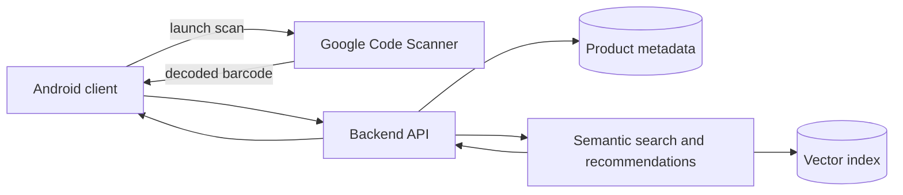

# Architecture

Status: proposed system architecture with a device-validated Android scanner slice; backend, data, and recommendation boundaries remain unvalidated.

The accepted terminology, boundaries, required views, and PlantUML file layout are defined in [`diagrams/README.md`](diagrams/README.md). The accepted proposed logical component view has canonical [PlantUML source](diagrams/component-architecture.puml), an [English technical render](diagrams/rendered/component-architecture.png), and a [Serbian formal render](diagrams/rendered/sr/component-architecture.png). The accepted proposed end-to-end flow has canonical [PlantUML source](diagrams/scan-to-recommendation-flow.puml), an [English technical render](diagrams/rendered/scan-to-recommendation-flow.png), and a [Serbian formal render](diagrams/rendered/sr/scan-to-recommendation-flow.png). Serbian presentation variants are accepted integrations of those same canonical sources.

The proposed operational boundary and thin delivery order are defined in [`MVP_SCOPE.md`](MVP_SCOPE.md). T-006/S1 fixes what the system must demonstrate; T-006/S2 still needs to assign concrete logical/deployment ownership without selecting implementation products.

## Implemented Android slice

- A single Gradle application module lives under `android/app` with namespace and application ID `rs.ac.ni.elfak.asap`.
- `MainActivity` is Java 17 code and renders a custom XML `ConstraintLayout` screen through AppCompat, with a scan action, current status, and decoded result.
- Google Code Scanner 16.1.0 is configured for EAN-13, EAN-8, UPC-A, and UPC-E with auto-zoom. The activity handles decoded, cancelled, empty-value, module/download-unavailable, and general-failure outcomes.
- The manifest requests install-time delivery of the unbundled `barcode_ui` module. The application declares no camera permission; Google Play services owns the camera experience. The merged dependency manifest adds internet and network-state permissions used by the scanner stack.
- There is no product lookup, application network client, persistence, backend integration, or recommendation behavior.
- The checksum-pinned Gradle 9.5.0 Wrapper builds the API 36 client with AGP 9.3.2. Seven local unit tests and Android lint pass.

This slice implements the Android-to-scanner launch and decoded-value boundary shown in the proposed diagrams. The debug APK is installed, its launcher activity is verified, and the user confirmed two successful real-product scans whose decoded values returned to the custom screen plus a cancellation that produced the intended status. The scanner module is therefore available and usable on the test phone; whether it was newly downloaded or already present is not observable from this run. Module/download and general failures have implemented and unit-tested handling, but were not deliberately induced on the physical phone.

## Intended components

- **Android client:** uses custom Java/XML screens, launches Google Code Scanner, receives the decoded barcode, and displays product data and recommendations.
- **Backend API:** coordinates metadata lookup, application-facing responses, and the recommendation service.
- **Product store:** maps barcodes to product metadata such as name, description, and category.
- **Semantic service:** produces or retrieves embeddings, performs cosine-similarity top-N search, and may apply MMR diversification.
- **Vector index:** stores product embeddings and supports nearest-neighbor retrieval.

## Planned personalization

History-based personalization is a committed extended-MVP capability after the complete P0 scan-to-similar-products path. A bounded last-K interaction history is the baseline candidate; the original centroid proposal, recency weighting, or another measurable aggregation method may be selected later. This is not implemented and still requires decisions about the exact window, event weighting, cold-start behavior, privacy, and evaluation. Generic semantic similarity and personalized ranking must remain separately labelled.

## Open architecture questions

- Which work beyond barcode scanning must run on-device, and which work requires a backend?
- Does later UX testing justify replacing Google Code Scanner with direct ML Kit Barcode Scanning and CameraX for a custom scanning camera experience?
- Is the backend a modular monolith for the MVP or multiple deployable services?
- Which external product API and fallback dataset satisfy coverage, reliability, and licensing needs?
- Which embedding model supports Serbian and the expected product languages?
- Is an exact vector search sufficient for MVP scale, or is an ANN index justified?
- What data may be retained for personalization, and how is user consent handled?

The historical image in `report/assets/asap-architecture.png` remains source material from the initial DOCX. The canonical PlantUML views now replace it in formal deliverables; except for the Android scanner slice explicitly listed above, they still describe proposed rather than implemented behavior.
