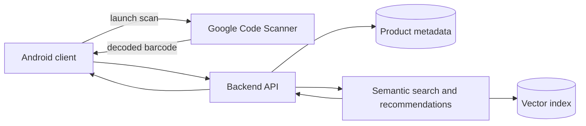

# Architecture

Status: proposed system architecture with one implemented Android shell slice; scanner, backend, data, and recommendation boundaries remain unvalidated.

The accepted terminology, boundaries, required views, and PlantUML file layout are defined in [`diagrams/README.md`](diagrams/README.md). The accepted proposed logical component view has canonical [PlantUML source](diagrams/component-architecture.puml), an [English technical render](diagrams/rendered/component-architecture.png), and a [Serbian formal render](diagrams/rendered/sr/component-architecture.png). The accepted proposed end-to-end flow has canonical [PlantUML source](diagrams/scan-to-recommendation-flow.puml), an [English technical render](diagrams/rendered/scan-to-recommendation-flow.png), and a [Serbian formal render](diagrams/rendered/sr/scan-to-recommendation-flow.png). Serbian presentation variants are accepted integrations of those same canonical sources.

## Implemented Android slice

- A single Gradle application module lives under `android/app` with namespace and application ID `rs.ac.ni.elfak.asap`.
- `MainActivity` is Java 17 code and renders one XML `ConstraintLayout` screen through AppCompat.
- The shell has a launcher manifest and vector icon, but no camera permission, scanner dependency, scanner metadata, networking, persistence, backend integration, or recommendation behavior.
- The checksum-pinned Gradle 9.5.0 Wrapper builds the API 36 shell with AGP 9.3.2. Local unit tests and Android lint pass.

This slice establishes build structure only. It does not yet validate any scan-to-recommendation interaction in the proposed diagrams.

## Intended components

- **Android client:** uses custom Java/XML screens, launches Google Code Scanner, receives the decoded barcode, and displays product data and recommendations.
- **Backend API:** coordinates metadata lookup, application-facing responses, and the recommendation service.
- **Product store:** maps barcodes to product metadata such as name, description, and category.
- **Semantic service:** produces or retrieves embeddings, performs cosine-similarity top-N search, and may apply MMR diversification.
- **Vector index:** stores product embeddings and supports nearest-neighbor retrieval.

## Planned personalization

The proposal represents a user as the centroid of embeddings associated with scanned or viewed products. This is not implemented and still requires decisions about event weighting, recency, cold-start behavior, privacy, and evaluation.

## Open architecture questions

- Which work beyond barcode scanning must run on-device, and which work requires a backend?
- Does later UX testing justify replacing Google Code Scanner with direct ML Kit Barcode Scanning and CameraX for a custom scanning camera experience?
- Is the backend a modular monolith for the MVP or multiple deployable services?
- Which external product API and fallback dataset satisfy coverage, reliability, and licensing needs?
- Which embedding model supports Serbian and the expected product languages?
- Is an exact vector search sufficient for MVP scale, or is an ANN index justified?
- What data may be retained for personalization, and how is user consent handled?

The historical image in `report/assets/asap-architecture.png` remains source material from the initial DOCX. The canonical PlantUML views now replace it in formal deliverables; except for the Android shell explicitly listed above, they still describe proposed rather than implemented behavior.
