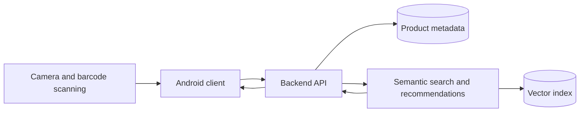

# Architecture

Status: initial hypothesis from the project proposal; not yet validated by implementation.

The accepted terminology, boundaries, required views, and PlantUML file layout are defined in [`diagrams/README.md`](diagrams/README.md). The accepted proposed logical component view has canonical [PlantUML source](diagrams/component-architecture.puml) and a [PNG render](diagrams/rendered/component-architecture.png). The end-to-end flow source remains pending under S3.

## Intended components

- **Android client:** captures camera frames, decodes a barcode locally, and displays product data and recommendations.
- **Backend API:** coordinates metadata lookup, application-facing responses, and the recommendation service.
- **Product store:** maps barcodes to product metadata such as name, description, and category.
- **Semantic service:** produces or retrieves embeddings, performs cosine-similarity top-N search, and may apply MMR diversification.
- **Vector index:** stores product embeddings and supports nearest-neighbor retrieval.

## Planned personalization

The proposal represents a user as the centroid of embeddings associated with scanned or viewed products. This is not implemented and still requires decisions about event weighting, recency, cold-start behavior, privacy, and evaluation.

## Open architecture questions

- Which work must run on-device, and which work requires a backend?
- Is barcode scanning implemented directly with ML Kit rather than a separately trained CNN?
- Is the backend a modular monolith for the MVP or multiple deployable services?
- Which external product API and fallback dataset satisfy coverage, reliability, and licensing needs?
- Which embedding model supports Serbian and the expected product languages?
- Is an exact vector search sufficient for MVP scale, or is an ANN index justified?
- What data may be retained for personalization, and how is user consent handled?

The current image in `report/assets/asap-architecture.png` is the source proposal diagram. Canonical PlantUML sources remain a TODO item.
